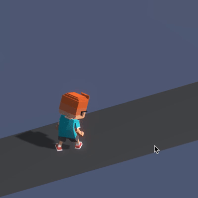

State machine states:

- ```idle```
- ```walkForward```

Scene tree:

```
UserRootObject | 03015175-F1A9-4275-B9D5-6604E71BB4DD
    MainCharacter | BFF6D5FA-CAEB-4C82-A718-334375C01085
        MainCharacter Body | 2ECB3BA4-F2F4-42DD-86E8-322283040C6C
            MainCharacter | DBC330CB-30FF-4346-8734-7679B88BC8EC
                GG_animations | BB9773A1-12B8-44AE-BD0E-9EE6D848863A
                    Idle_Alt2.fbx | 357E3A71-82B1-4A79-BDE6-71F7477CECEA        | Plain
                        299688C6-1019-4261-97F4-2B249AECBC00
                    Idle_look_around.fbx | 2A489969-4860-4DFF-8749-1DCB7550C074 | Plain
                        E37AFDD4-8FFA-4550-BB32-40DCC78076E0
                    Running.fbx | E79A0D7C-7448-4ECC-9AF7-D60FEEEED95C          | Plain
                        1866A820-41DD-4A40-9561-03AF112A0633
            Animations | 6C3E5606-B8B7-4C82-A796-AF1AEB825679
                anim_idle | D165BB29-145F-4916-9F01-C25667C378E0 | Inserted animations: Idle_look_around.fbx, Idle_Alt2.fbx
                    130D1B39-3310-49F9-A084-40034076059B
                anim_walk | 0D13C93B-61C0-427B-9F43-1C2A43E5B916 | Inserted animations: Running.fbx
                    3E74B209-42A0-4090-94E4-4F4DE3EDFDF0
```
